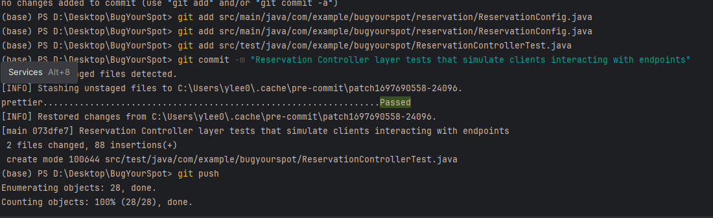
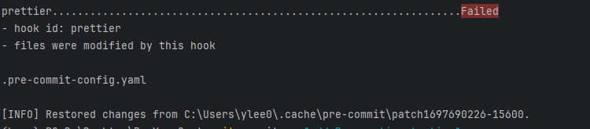

# BugYourSpot 🐛🐞🪲

a reservation booking service, made with <3 by BugBusters.\
Peter Ma, Faustina Cheng, Shreya Somayajula, Youngseo Lee, & Patrick Tong

# Components:

API Description and Workflow:
BugYourSpot's structure derives from Spring Boot Flow Architecture examples, which provide several layers of abstraction between the client and the service itself. The client, which is any business that would need to employ some reservation schedule—restaurants, hospitals, the DMV, and more—can make use of several API endpoints to send certain requests. The parameterized information that the client sends is then parsed and gradually propagated throughout the various layers, with various elements of error checking occurring at different levels.

The ReservationController class acts as the first level of interaction with the client, using `@PostMapping`, `@GetMapping`, `@DeleteMapping`, and `@GetMapping` annotations to define several endpoints that the client will connect to. The first endpoint that businesses will utilize is the `createReservationSchema`, which allows the business to define custom fields that are relevant to their unique customers. For instance, restaurants may elect for a field such as "occasion" to indicate something like an anniversary or a birthday celebration. On the other hand, hospitals may designate a field called "doctor" to store which doctor each reservation will be meeting with. The custom schemas are managed on the backend through an Entity-Attribute Value Model; this structure makes use of several individual tables, linking them together through primary keys and allowing for easy field customizability across different clients. Here is a preliminary diagram of our database.

The ReservationService class acts as the next layer of logic, providing the method definitions for functions such as `addNewReservation()`, `deleteReservation()`, and `updateReservation()`. The class initializes an instance of a `ReservationRepository` object, which represents the lowest layer connected to the actual database. Through this object, the ReservationService class implements certain exception handling cases such as when the client / business attempts to delete a non-existent reservation.

`POST /reservations/createReservationSchema`\
Description: Application provides certain fields that they want to represent a reservation with. This is in the form of a JSON object. The service validates these fields to ensure that it matches the expected format. Once validated, our service will dynamically generate the database schema based on the custom fields and their data types. Thus, this API should be called just once and before all other API calls.\
Request Body: JSON object that represents the fields of a reservation\
Example Usage: `/createReservationSchema`

1. Restaurant

```json
{
  "fields": [
    {
      "name": "date",
      "type": "date"
    },
    {
      "name": "hour",
      "type": "integer"
    },
    {
      "name": "numSlots",
      "type": "integer"
    },
    {
      "name": "clientId",
      "type": "integer"
    },
    {
      "name": "userId",
      "type": "integer"
    },
    {
      "name": "allergies",
      "type": "varchar"
    },
    {
      "name": "partySize",
      "type": "integer"
    },
    {
      "name": "specialOccasion",
      "type": "varchar"
    }
  ]
}
```

2. Hospital

```json
{
  "fields": [
    {
      "name": "date",
      "type": "date"
    },
    {
      "name": "hour",
      "type": "integer"
    },
    {
      "name": "numSlots",
      "type": "integer"
    },
    {
      "name": "clientId",
      "type": "integer"
    },
    {
      "name": "userId",
      "type": "integer"
    },
    {
      "name": "notes",
      "type": "varchar"
    },
    {
      "name": "insurance_provider",
      "type": "varchar"
    },
    {
      "name": "doctor",
      "type": "varchar"
    }
  ]
}
```

Response Format:

```json
{
  "status": "success",
  "data": null
}
```

Possible statuses: “success”, “client already initialized”, “wrong format”

Parse JSON and populate key(label) value(datatype) map
Check if mandatory fields are included
Status code (WRONG FORMAT) if not included
Iterate through key value map, adding new row to Attribute entity
Insert row in InitializedSchema entity

`POST /reservations/createReservation`\
Description: Create a new reservation.\
Request Body: JSON object representing the reservation details.\
Example Usage: `/reservations/createReservation`

1. Restaurant

```json
{
  "date": 2023-10-05,
  "hour": 17,
  "numSlots": 2,
  “clientId”: 3,
  "userId": 55,
   "allergies": “trader joes peanut butter filled pretzel nuggets”,
  “partySize”:10,
 “specialOccasion”:”birthday”
}

Hospital
	{
  "date": 2023-10-06,
  "hour": 8,
  "numSlots": 1,
  “clientId”: 36,
  "userId": 59,
  “notes”: “Concern for high blood pressure”,
  "insurance_provider": “Aetna”,
   "doctor": “Dr.  Seuss”
}

Response Format:
{
    "status": "success",
    "data": [{
	“reservationId”: 46
     }]
}
```

Possible statuses: “success”, “client not initialized”, “invalid slot”, “wrong format”

Error if client not initialized
Parse JSON into `ReservationDTO` object
Call `AddNewReservation`, passing in the `ReservationDTO` object
Validation (status code: WRONG FORMAT if incorrect):
Get labels and datatype from Attributes table where clientId = our client
Check if all labels are passed in through JSON
Go through each attribute and add into correct entity based on datatype
Add to Reservations and update Occupancy
Validation (status code: INVALID SLOT if time slot is not valid)
Get all available time slots for the client
Check that requested time slots exist and are free
Return `reservationId` for successful reservation

`PUT /reservations/updateReservation`\
Description: Update an existing reservation or time slot.\
Usage: Applications can use this endpoint to modify reservation details, such as changing the booking time or updating user information.\

Request Body: JSON with reservationId, clientId, and the fields to be updated

Example request:

```json
{
  "reservationId": 334,
  “clientId”: 36,
  “notes”: “Concern for high blood pressure and diarrhea”,
   "doctor": “Dr. Phil”
}
```

Response Format:

```json
{
  "status": "success",
  "data": null
}
```

Possible statuses: “success”, “client not initialized”, “wrong format”

Error if client not initialized
Parse JSON using the Jackson library
Status code: WRONG FORMAT if reservationId or clientId not included, or fields to update are not in attributes list for that client
Update given attributes

`DELETE /reservations/deleteReservation`\
Description: Delete a reservation or time slot.
Usage: Applications can call this endpoint to remove a reservation when it's no longer needed or has been canceled.
Request Body: `reservationId`

Response Format:

```json
{
  "status": "success",
  "data": null
}
```

Possible statuses: “success”, “client not initialized”, “no reservation found”

Error if client not initialized, or reservationId not in Reservations
Delete row from Reservations table, update Occupancy, delete relevant rows with the same reservationId from the relevant datatype tables

`GET /reservations/getReservation`\
Description: Retrieve a list of all reservations made by a client.\
Query Parameters: `clientId`

Our service will return all reservations made by the client – represented as a simple JSON object with a list of reservation objects.

Example Response:
Possible statuses: “success”, “client not initialized”

```json
{
  "status": "success",
  "data": [
    {
      "date": "2023-10-05",
      "hour": 17,
      "numSlots": 2,
      "clientId": 3,
      "userId": 55,
      "allergies": "trader joes peanut butter filled pretzel nuggets",
      "partySize": 10,
      "specialOccasion": "birthday"
    },
    {
      "date": "2023-10-07",
      "hour": 19,
      "numSlots": 3,
      "clientId": 4,
      "userId": 56,
      "allergies": "shrimp",
      "partySize": 5,
      "specialOccasion": "anniversary"
    },
    {
      "date": "2023-10-10",
      "hour": 20,
      "numSlots": 1,
      "clientId": 5,
      "userId": 57,
      "allergies": "dairy products",
      "partySize": 3,
      "specialOccasion": "promotion"
    },
    {
      "date": "2023-10-15",
      "hour": 18,
      "numSlots": 2,
      "clientId": 6,
      "userId": 58,
      "allergies": "gluten",
      "partySize": 7,
      "specialOccasion": "family gathering"
    },
    {
      "date": "2023-10-20",
      "hour": 21,
      "numSlots": 4,
      "clientId": 7,
      "userId": 59,
      "allergies": "nuts",
      "partySize": 8,
      "specialOccasion": "reunion"
    }
  ]
}
```

# Tests

Using JUnit + Mockito framework

- Unit Tests:
  - `ReservationRepositoryTest.java`
  - `ReservationServiceTest.java`
  - `ReservationTest.java`
- System Tests: - `ReservationControllerTest.java` - Mock server-client communication over network (with localhost) using Intellij's HTTP Client Tool ###
  Example System Test Run:

```
POST http://localhost:8080/api/v1/reservation
Content-Type: application/json

{
  "clientId":4118,
  "startTime":"2023-10-14T15:01:13.83666",
  "endTime":"2023-10-14T15:01:13.836673"
}

<> 2023-10-14T164311.500.json
<> 2023-10-14T164200.500.json

###
DELETE http://localhost:8080/api/v1/reservation/1

<> 2023-10-14T165008.500.json

###
PUT http://localhost:8080/api/v1/reservation/1?endTime=2022-10-14T17:05:59.504538

<> f-1.txt
<> f.txt
<> 2023-10-14T170612.404.json
<> 2023-10-14T165008.500.json

###
POST http://localhost:8080/api/v1/reservation
```

Example Failed Requests

```
{
  "timestamp": "2023-10-14T20:43:11.124+00:00",
  "status": 500,
  "error": "Internal Server Error",
  "message": "client taken",
  "path": "/api/v1/reservation"
}


{
  "timestamp": "2023-10-14T20:50:08.552+00:00",
  "status": 500,
  "error": "Internal Server Error",
  "message": "reservation with id 1 does not exist",
  "path": "/api/v1/reservation/1"
}
```

# Setting up Style Checker

To set up pre commit hooks for linting: <br>
`pip install pre-commit`\
`pre-commit install`

Example Style Checker Reports:\



# How to Build, Run, & Test

- Currently: the PostgreSQL database is being hosted locally. Thus, end-to-end testing of this service can only be done on our local machines. We start up our database, use Maven to build the service, and execute all unit/system tests by manually running them in an IDE.
- Next steps: use Docker to create container for application. From there, our client will be able to run an instance of our program on any machine, since the PostgreSQL database will be hosted on GCP. Further, we will set up a git pre-push hook to automatically run all unit and system tests upon pushing to the repo.

# How to See Code Coverage

`mvn clean test jacoco:report`\
Then, open **../BugYourSpot/target/site/jacoco/com.example.bugyourspot.reservation/index.html**

# Sources

[Spring Boot Tutorial](https://www.youtube.com/watch?v=9SGDpanrc8U&t=1333s)\
[EAV Explained](https://www.youtube.com/watch?v=9SGDpanrc8U&t=1333s)
